<p align="center">
  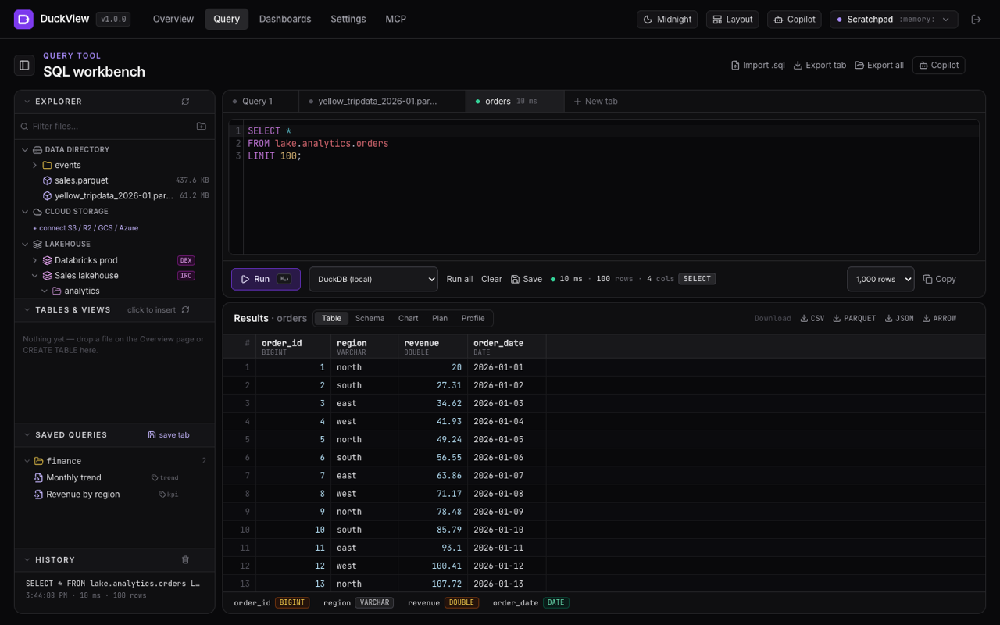
</p>

<h1 align="center">DuckView</h1>

<p align="center">
  <strong>The analytics workspace where DuckDB, your lakehouse and your AI agents meet.</strong><br>
  Query files, warehouses and Iceberg catalogs from one SQL workbench. Build dashboards. Let agents do the same — safely.
</p>

<p align="center">
  <a href="https://contact-ajmal.github.io/DuckView/"></a>
  <a href="https://github.com/contact-ajmal/DuckView/actions/workflows/ci.yml"></a>
  <a href="https://hub.docker.com/r/anbproject/duckview"></a>
  <a href="https://hub.docker.com/r/anbproject/duckview"></a>
  
  
  
  
</p>

<p align="center">
  <a href="https://contact-ajmal.github.io/DuckView/"><b>Website</b></a> ·
  <a href="https://contact-ajmal.github.io/DuckView/docs/index.html"><b>Docs</b></a> ·
  <a href="#-quick-start">Quick start</a> ·
  <a href="#-what-you-get">Features</a> ·
  <a href="#-lakehouse-connectors">Lakehouse</a> ·
  <a href="#-built-for-ai-agents">Agents & MCP</a> ·
  <a href="#-duckcopilot">Copilot</a> ·
  <a href="#-themes">Themes</a> ·
  <a href="#-security-model">Security</a> ·
  <a href="docs/REFERENCE.md">Technical reference</a>
</p>

---

## Why DuckView?

Most "SQL UIs" stop at the query box. DuckView is a complete, self-hosted data workspace built on a **native DuckDB engine per workspace** — no Python sidecars, no JDBC, no data leaving your machine unless you ask it to.

|  |  |
|---|---|
| ⚡ **Query anything, instantly** | Parquet, CSV, JSON, Excel, DuckDB files, S3 / R2 / GCS / Azure objects — and now **Iceberg catalogs on AWS Glue, S3 Tables, any Iceberg REST catalog and Databricks**. Drop a file or add a folder and it's queryable in seconds. |
| 🤖 **Agent-native from day one** | A hardened **MCP server** plus a **REST / OpenAPI façade** expose the same tools to Claude Desktop, Cursor, Claude Code, Strands, LangGraph, LangChain, CrewAI, Bedrock AgentCore and Bedrock Agents. Every mutation is held for **human approval**. |
| 🧠 **DuckCopilot** | An in-app assistant hydrated with your live schema, files, buckets and the SQL you're writing. Bring Anthropic, OpenAI, Ollama, Amazon Bedrock — or point it at **your own agent** on AgentCore. |
| 📊 **From profile to dashboard** | Auto-profiling on load (KPIs, null ratios, distributions), a tabbed IDE-style workbench with charts, plans and profiles, and a drag-and-drop BI dashboard builder with auto-refresh. |
| 🔍 **Explore, interactively** | Every column of a file, table or query becomes a linked chart — brush one and the rest cross-filter, at data-cube speed on millions of rows, computed in the workspace engine. Built on [Mosaic](https://idl.uw.edu/mosaic/). |
| 🧩 **Data apps (Streamlit)** | Write a Streamlit app on a workspace's tables and files — `duckview.connect()`, `query(sql)` → pandas, a table picker, the viewer's identity — and DuckView runs it: Python environment created on first start, code editor with live preview, apps served under `/apps/<id>/` to the workspace's members with a read-only, workspace-scoped token. `pip install duckview` for the SDK anywhere else. |
| 🔌 **Connections & syncs** | One page for every source — S3/R2/GCS/Azure, Glue/S3 Tables/Iceberg REST/Databricks, PostgreSQL/MySQL/SQLite/DuckDB files, **Snowflake, BigQuery, Redshift, ClickHouse, Fabric**, **Salesforce, HubSpot, Stripe, GA4, Airtable, Notion**, HTTP endpoints and **Google Drive / Sheets with your Google account** — with health checks, credentials encrypted and write-only, and **scheduled syncs** that load a table, object, file or SELECT into a workspace with an optional transformation (drafted by Copilot or set by an agent), recorded run by run. |
| 🧩 **Mosaic dashboards** | Declarative, cross-filtered dashboards from a YAML/JSON spec: editor with live preview, generated from any table or file in one click, drafted by Copilot or created by agents (`create_mosaic_dashboard`), validated against your data before they are saved. |
| ⚡ **Fast the second time** | A two-tier result cache — shared on the server, per user in the browser — keyed on file fingerprints and a workspace data epoch, so a 10 s profile of a 400 MB CSV comes back in milliseconds for everyone, and is *never* stale after a mutation. |
| 👥 **Built for teams** | Share a workspace with people or teams as **viewer / editor / owner**. Dashboards and saved queries are shared; tabs stay personal. Teams mirror your IdP groups over OIDC, so `okta:finance` is a share target on day one. |
| 🔒 **Enterprise hardening** | Filesystem jail, DuckDB `lock_configuration`, per-workspace memory/thread limits, AES-256-GCM credential vault, scoped API tokens, audit log, Prometheus + OpenTelemetry, OIDC with group → role mapping. |
| 🎨 **Yours to shape** | Six themes (three dark, three light incl. a *Professional* corporate look), resizable IDE panes, and the ability to hide any component and bring it back. |

---

## 🚀 Quick start

> 🌐 **Website & documentation:** [contact-ajmal.github.io/DuckView](https://contact-ajmal.github.io/DuckView/) — feature tour, every deployment option, and the full guides (getting started, configuration, security, sharing & teams, result cache, lakehouse, agents & MCP, API).

```bash
git clone https://github.com/contact-ajmal/DuckView.git && cd DuckView
pnpm install && pnpm build
DUCKVIEW_ADMIN_EMAIL=admin@example.com DUCKVIEW_ADMIN_PASSWORD='change-me' pnpm start
# → http://localhost:4200  (set JWT_SECRET / ENCRYPTION_KEY for anything beyond a first look)
```

Or with Docker — a multi-arch image (amd64 + arm64) is published to [Docker Hub](https://hub.docker.com/r/anbproject/duckview):

```bash
docker run -p 4200:4200 -v duckview-data:/data -v duckview-meta:/app/meta \
  -e DUCKVIEW_ADMIN_EMAIL=admin@example.com -e DUCKVIEW_ADMIN_PASSWORD='change-me' \
  anbproject/duckview:latest
```

`docker compose up` gives you the same with persistent volumes; add `--profile postgres` for a PostgreSQL metadata store, `--profile ollama` for a local Copilot, `--profile observability` for Prometheus + Grafana. Kubernetes manifests live in [`k8s/`](k8s).

> **Requirements:** Node 20+, pnpm 10. DuckDB ships as a native module — nothing else to install.

---

## ✨ What you get

### Overview — your data, profiled on arrival

Drop a file or add a folder from anywhere on your machine (VS Code-style workspace folders). DuckView profiles it immediately: row/column counts, type mix, null ratios, duplicate rows, min/max/avg per column and equi-width distributions — all computed by DuckDB, never sampled by hand.

<p align="center">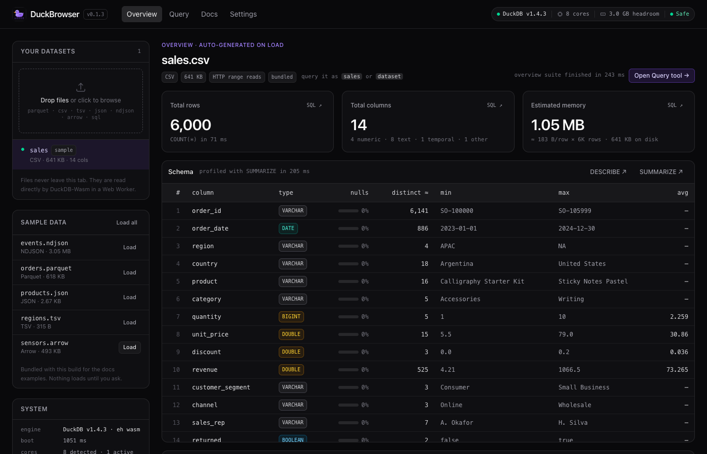</p>

### Workbench — an IDE for SQL

Tabs with per-tab *Stop*, cursor and draft persistence, a schema explorer that opens at the bottom when you click a file, chart / plan / profile views, `.sql` import/export, a saved-query library with folders and tags, and streaming results over WebSocket. Every pane is a resizable splitter; every component can be hidden and restored.

<p align="center">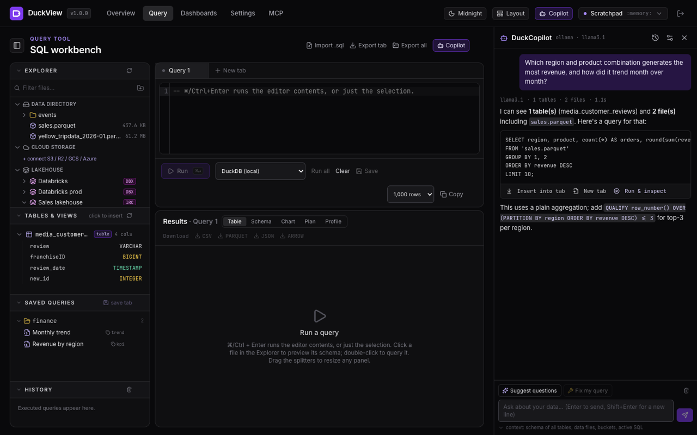</p>

### Dashboards — from query to executive view in minutes

KPI, chart, table and Markdown widgets on a drag-and-drop grid with auto-refresh. Widgets run the same guarded queries as the workbench — and agents can build dashboards for you through `create_dashboard_widget`.

<p align="center">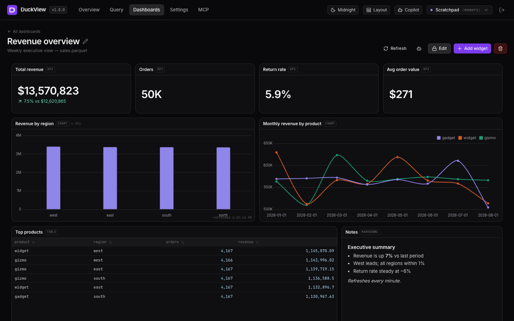</p>

---

## 🧊 Lakehouse connectors

Attach catalogs once; query them as `alias.schema.table` from SQL, dashboards, Copilot and agents alike. Credentials are encrypted at rest and applied to running engines **without a restart** — your in-memory tables survive.

| Platform | How | Auth |
|---|---|---|
| **AWS Glue / SageMaker Lakehouse** | Native DuckDB `ATTACH` over Glue's Iceberg REST endpoint (SigV4). Federated / S3 Tables catalogs via `s3tablescatalog/<bucket>`. | Access keys or the server's IAM role |
| **Amazon S3 Tables** | `ATTACH` by table-bucket ARN | Access keys or IAM role |
| **Iceberg REST** | Polaris, Lakekeeper, Nessie, Snowflake Open Catalog, Tabular, Unity Catalog IRC | Bearer · OAuth2 client credentials · none |
| **Databricks** | Browse Unity Catalog; run SQL on a **SQL warehouse** (Statement Execution API); **materialise** results into DuckDB to join with local data; optionally attach UniForm tables natively | PAT or OAuth M2M — works with **Free Edition** |

<p align="center">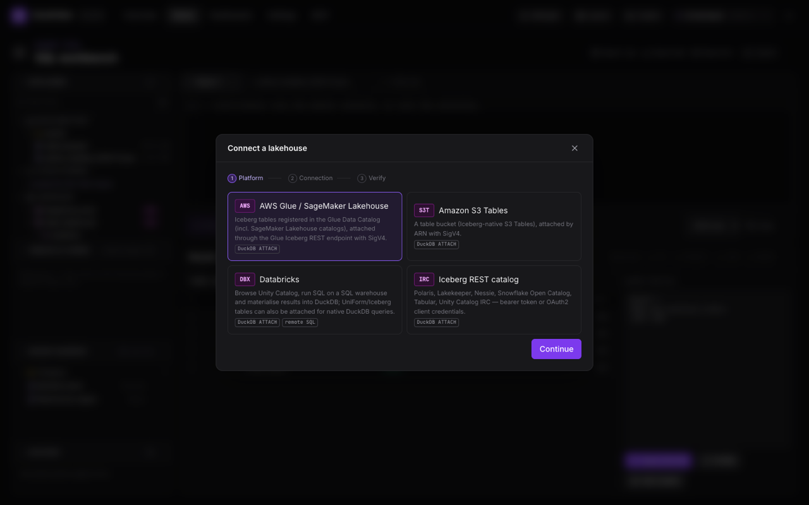</p>

Browsing is lazy — DuckView lists namespaces and tables without loading table metadata until you `DESCRIBE` or query. A tab's **engine picker** switches between DuckDB and any Databricks warehouse; remote results land in the same grid with a one-click *Materialise into DuckDB*.

---

## 🤖 Built for AI agents

DuckView treats agents as first-class users. **One tool registry** backs three surfaces, so they can never drift:

- **MCP server** — stdio, legacy SSE and Streamable HTTP; 10 tools, 3 resources, 2 guided prompts.
- **REST façade** — `POST /api/agent/v1/tools/<tool>` for frameworks that prefer plain HTTPS.
- **OpenAPI 3.0** — generated on the fly for Bedrock Agents action groups and AgentCore Gateway targets.

<p align="center">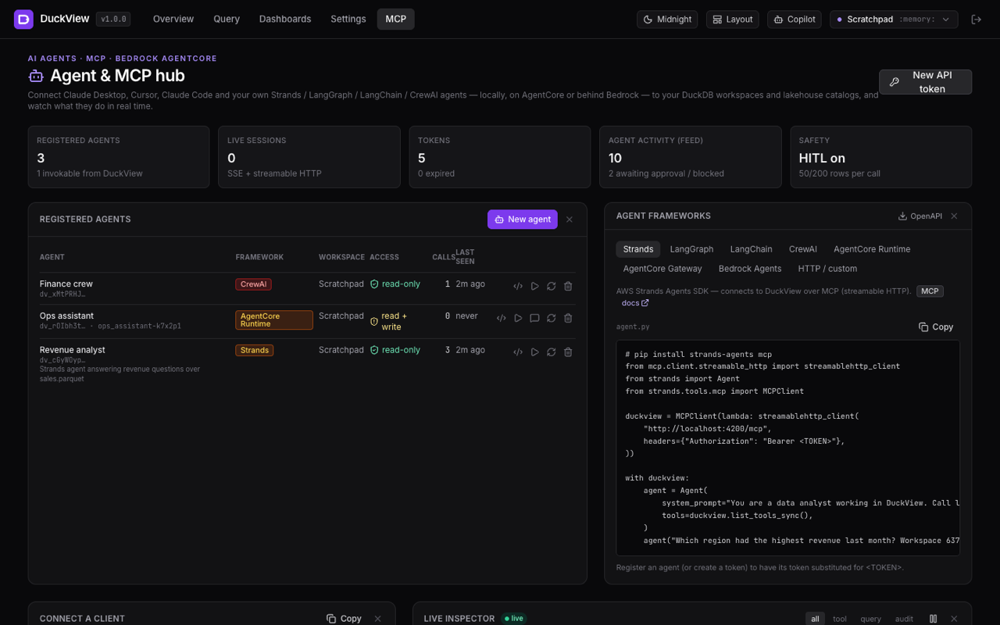</p>

**Register an agent** — Strands, LangGraph, LangChain, CrewAI, AgentCore Runtime / Gateway, Bedrock Agents or anything custom — and DuckView mints a workspace-scoped token, shows a copy-paste snippet with the token already filled in, attributes every call in the **live inspector**, and lets you self-test or *chat with* AWS-hosted agents right from the hub.

```python
# Strands — the whole integration
duckview = MCPClient(lambda: streamablehttp_client("https://duckview.example.com/mcp",
                                                   headers={"Authorization": "Bearer dv_…"}))
with duckview:
    Agent(tools=duckview.list_tools_sync())("Which region grew fastest last quarter?")
```

**Safety is not optional.** Results are capped, long strings truncated, paths jailed, and every mutating statement — local or on a Databricks warehouse — returns an *approval challenge* until a human re-issues it with `dry_run=false`.

| Tool | What it does |
|---|---|
| `execute_query` | Guarded DuckDB SQL with paging — including attached lakehouse catalogs |
| `profile_dataset` · `inspect_schema` · `explain_query` | SUMMARIZE stats, DESCRIBE without scanning, physical plans with timings |
| `list_accessible_data` · `browse_storage` | Workspaces, tables, files, cloud buckets and lakehouse catalogs — one level at a time |
| `lakehouse_query` | SQL on a Databricks SQL warehouse |
| `save_dataset` · `list_dashboards` · `create_dashboard_widget` · `create_mosaic_dashboard` | Materialise results, build grid and Mosaic dashboards |
| `list_data_sources` · `browse_connector` · `connector_query` · `create_data_sync` · `update_data_sync` · `run_data_sync` | Connections with health, warehouse/SaaS/Google browsing and remote SQL, scheduled loads with validated transformations |

---

## 🧠 DuckCopilot

Ask in plain English; get DuckDB SQL you can insert, open in a tab, or *run & inspect* — the result is explained back in business language. Copilot sees your tables and columns, data files, buckets, the active tab's SQL and, for selected datasets, `SUMMARIZE` statistics.

| Provider | Notes |
|---|---|
| **Claude** | Official Anthropic SDK, streaming, `claude-opus-5` by default |
| **ChatGPT / OpenAI** · **Gemini** · **DeepSeek** · **OpenRouter** · **Kimi** · **Groq** · **Mistral** · **Grok** | One OpenAI-compatible bridge with a preset per vendor (endpoint, key console link, suggested models); OpenRouter gives one key for hundreds of models |
| **Ollama** · **any OpenAI-compatible endpoint** | Local models, or Together / Fireworks / Perplexity / Azure OpenAI / vLLM / LM Studio |
| **Amazon Bedrock** | Converse streaming with model / inference-profile discovery |
| **Bedrock Agent** · **AgentCore runtime** | Route the drawer to *your* deployed agent; DuckView passes the workspace context along |

**Settings → Copilot** is the console: pick a vendor card, paste a key (the card links to where you get one), *Test connection*, *Save for everyone* — stored encrypted, live immediately. People can also bring their own key (browser-only). The **Usage** panel shows the sessions running right now and tokens per day, model and person.

---

## 🎨 Themes

Six themes decide both colour and typeface, applied through runtime CSS variables so every component — charts, code editor, gauges — follows. First visit follows your OS scheme.

<table align="center">
  <tr>
    <td align="center">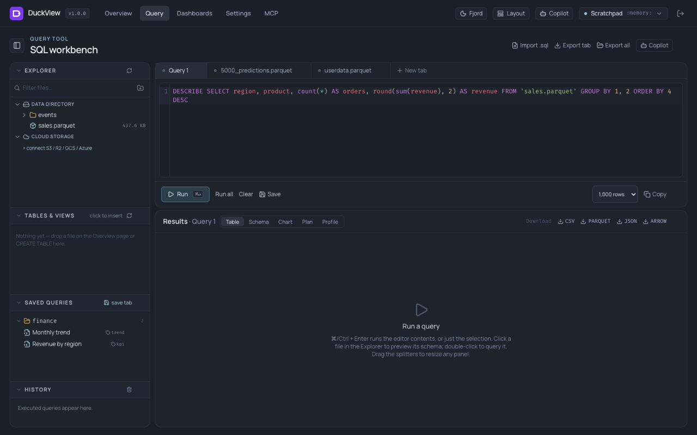<br><sub><b>Fjord</b> · Nord-style teal</sub></td>
    <td align="center">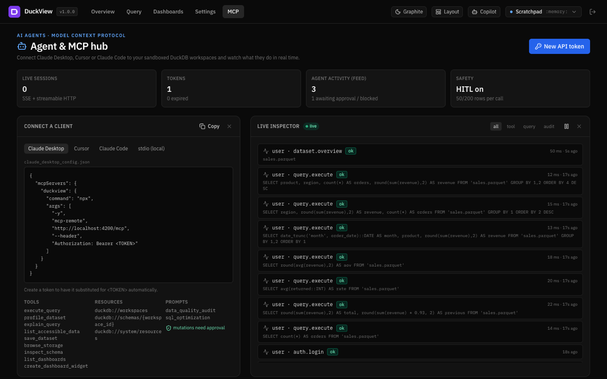<br><sub><b>Graphite</b> · neutral / blue</sub></td>
    <td align="center">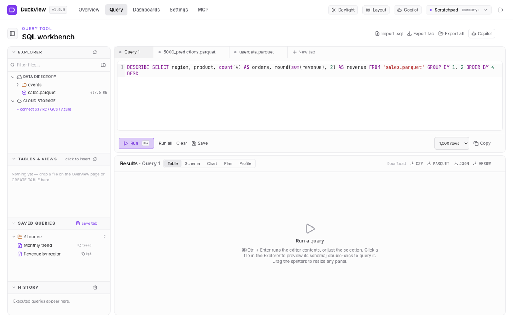<br><sub><b>Daylight</b> · light / violet</sub></td>
  </tr>
  <tr>
    <td align="center">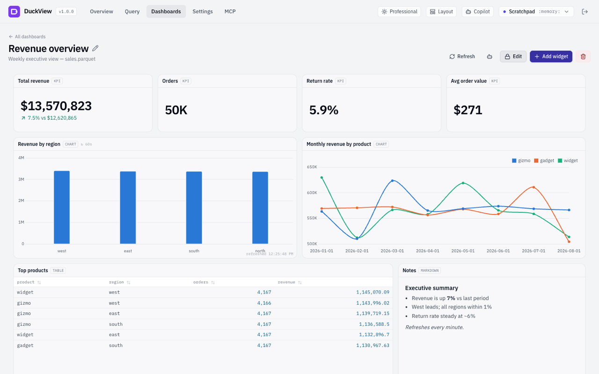<br><sub><b>Professional</b> · corporate navy, IBM Plex</sub></td>
    <td align="center">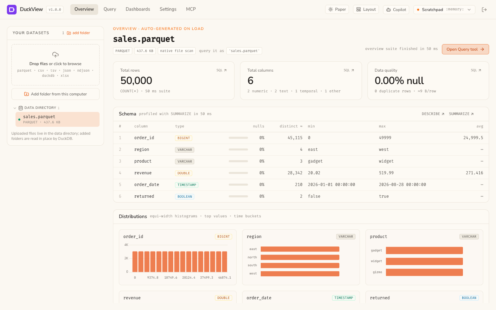<br><sub><b>Paper</b> · warm off-white / orange</sub></td>
    <td align="center">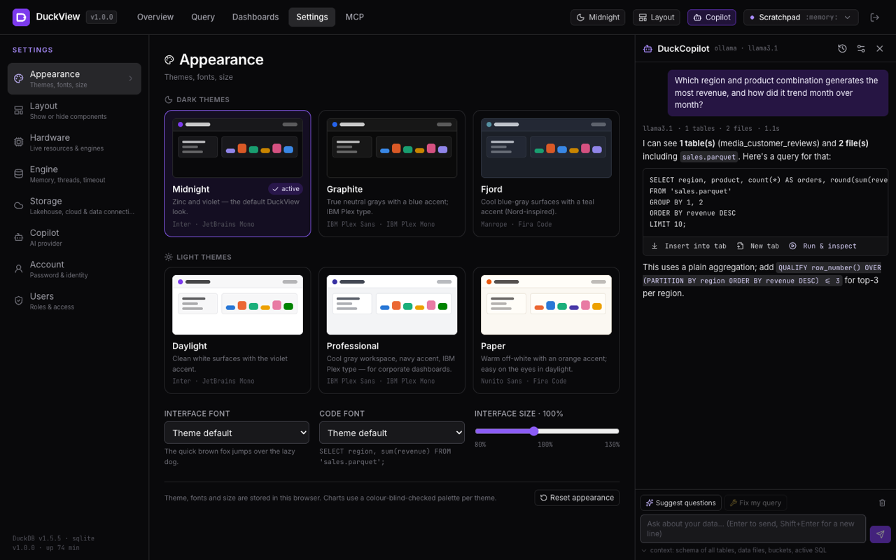<br><sub><b>Appearance</b> · fonts & UI scale</sub></td>
  </tr>
</table>

---

## 🔒 Security model

- **Two layers of sandboxing** — a Node-side filesystem jail *and* DuckDB's own `allowed_directories` / `enable_external_access` / `lock_configuration`, so even `SET` and `PRAGMA` can't loosen the box. `filesystem_mode: full` for a personal workstation, `sandboxed` for multi-tenant.
- **A single choke point** — every query, from the UI or an agent, passes authorization → SQL guard → HITL → audit.
- **Secrets never leave the server** — cloud, lakehouse and data-connection credentials are AES-256-GCM encrypted with the row id as AAD and applied to DuckDB as scoped `CREATE SECRET`s; the API never returns them.
- **Scoped tokens** — `read` / `write` / `mcp` / `admin`, optional workspace pinning and expiry, SHA-256 at rest, revocable per agent.
- **Workspace roles** — every access resolves to owner / editor / viewer through direct or team grants; non-members get a 404, viewers can't mutate even with an approved agent call, and members query through the owner's connections (stated in the share dialog, not hidden).
- **Observability** — Prometheus metrics, OpenTelemetry traces, liveness/readiness probes, real-time audit feed.

---

## 🏗 Architecture at a glance

```
React 19 · Vite · Tailwind v4 · Chart.js · CodeMirror
        │  REST · WebSocket (rows, live events) · SSE (Copilot, MCP) · Streamable HTTP
Fastify 5 (TypeScript strict)
  auth (local · OIDC · API tokens)   sharing (owner / editor / viewer, teams)
  QueryService (authz → guard → HITL → audit)
  Lakehouse (Iceberg ATTACH · Databricks SQL API)   Agent tool registry → MCP + REST + OpenAPI
  Copilot bridge (Claude · OpenAI-compatible vendors · Ollama · Bedrock · Bedrock Agent · AgentCore)
        │
EngineManager — one native DuckDB instance per workspace (LRU + idle TTL), jailed and locked
        │
Metadata (Drizzle) — SQLite by default, PostgreSQL via DATABASE_URL
```

Full details — configuration keys, every endpoint, the MCP tool contracts, CLI, Kubernetes and CI — are in the [technical reference](docs/REFERENCE.md).

---

## 🧪 Quality

`pnpm test` runs **237 tests** that boot real DuckDB engines and the MCP server over every transport, serve **real Iceberg tables** through a mock REST catalog, emulate a Databricks workspace (Unity Catalog + Statement Execution API), stand in for Snowflake, BigQuery, Redshift, ClickHouse, Salesforce, HubSpot, Stripe, GA4, Airtable, Notion and Google's OAuth / Drive / Sheets APIs, and exercise the agent façade against a fake AWS bridge. `scripts/smoke.mjs` verifies a running instance end to end.

---

## 🗺 Roadmap

- Delta Lake browsing via the `delta` extension
- Scheduled dashboard snapshots & alerts
- Row-level access policies per workspace
- Per-user data directories (isolation inside the jail)
- Comments on dashboards and saved queries

Ideas and pull requests welcome — open an [issue](https://github.com/contact-ajmal/DuckView/issues).

<p align="center"><sub>Built with DuckDB, Fastify, React and a lot of ⌘↵.</sub></p>
