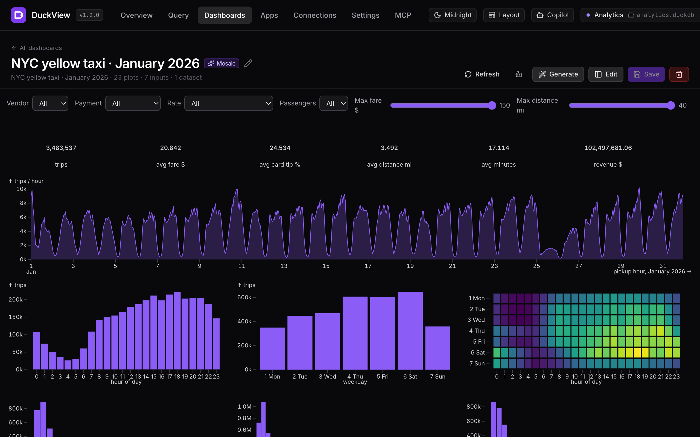
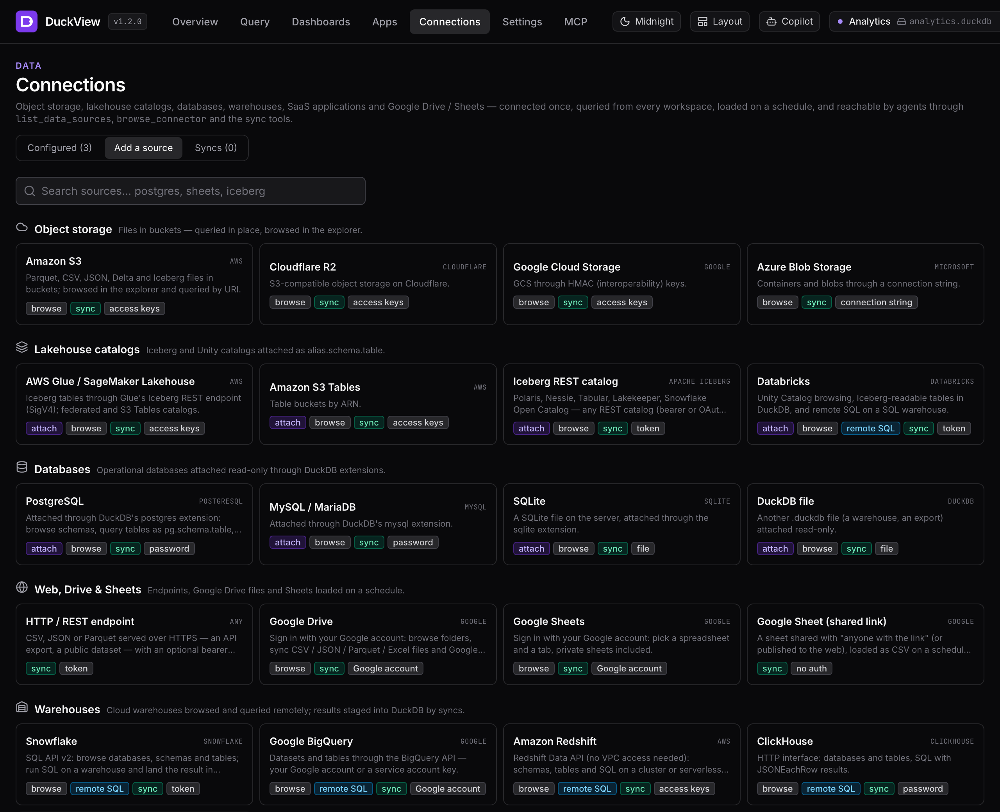
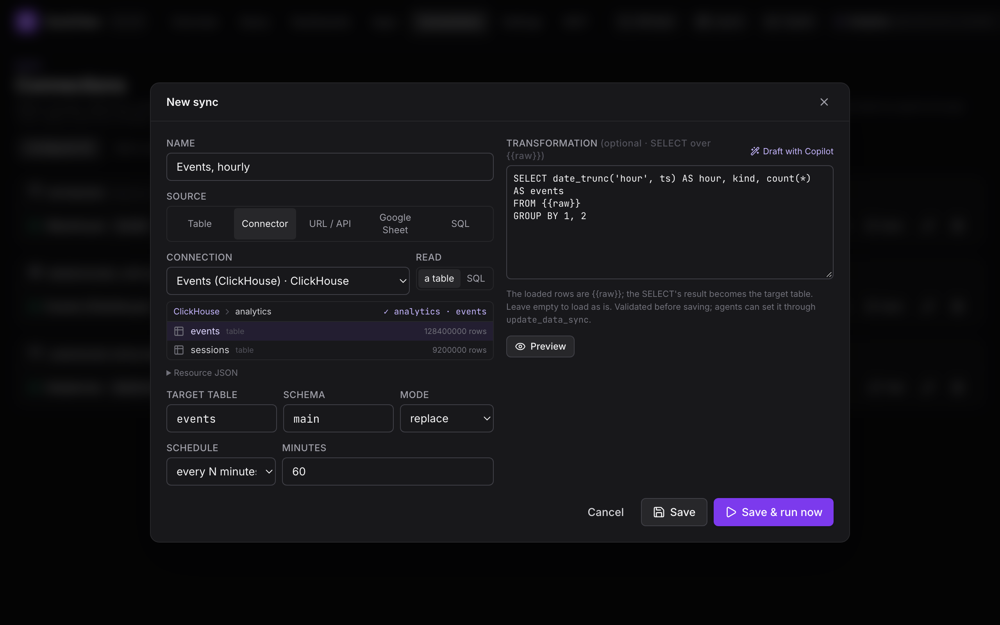
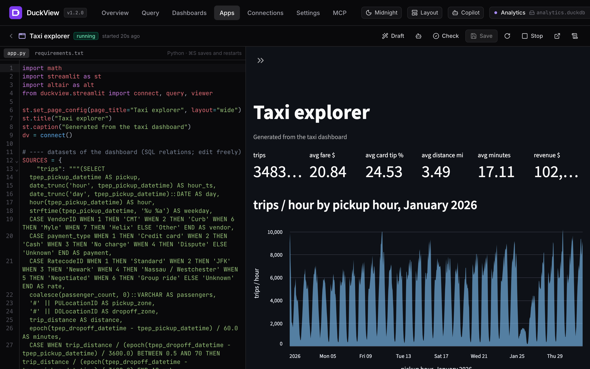
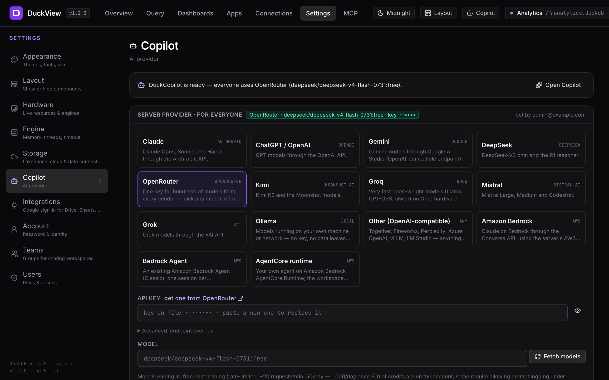

<p align="center">
  
</p>

<h1 align="center">DuckView</h1>

<p align="center">
  <strong>The analytics workspace where DuckDB, your lakehouse and your AI agents meet.</strong><br>
  Query files, warehouses and Iceberg catalogs from one SQL workbench. Build dashboards. Let agents do the same — safely.
</p>

<p align="center">
  <a href="https://contact-ajmal.github.io/DuckView/"></a>
  <a href="https://github.com/contact-ajmal/DuckView/actions/workflows/ci.yml"></a>
  <a href="https://hub.docker.com/r/anbproject/duckview"></a>
  <a href="https://hub.docker.com/r/anbproject/duckview"></a>
  
  
  
  
</p>

<p align="center">
  <a href="https://contact-ajmal.github.io/DuckView/"><b>Website</b></a> ·
  <a href="https://contact-ajmal.github.io/DuckView/docs/index.html"><b>Docs</b></a> ·
  <a href="#-quick-start">Quick start</a> ·
  <a href="#-what-you-get">Features</a> ·
  <a href="#-connections--syncs">Connections</a> ·
  <a href="#-data-apps-streamlit-dash-gradio">Data apps</a> ·
  <a href="#-lakehouse-connectors">Lakehouse</a> ·
  <a href="#-built-for-ai-agents">Agents & MCP</a> ·
  <a href="#-duckcopilot">Copilot</a> ·
  <a href="#-security-model">Security</a> ·
  <a href="docs/REFERENCE.md">Technical reference</a>
</p>

---

## Why DuckView?

Most "SQL UIs" stop at the query box. DuckView is a complete, self-hosted data workspace built on a **native DuckDB engine per workspace** — no Python sidecars, no JDBC, no data leaving your machine unless you ask it to.

|  |  |
|---|---|
| ⚡ **Query anything, instantly** | Parquet, CSV, JSON, Excel, DuckDB files, S3 / R2 / GCS / Azure objects, Iceberg catalogs on AWS Glue, S3 Tables, any Iceberg REST catalog and Databricks. Drop a file, add a folder from anywhere on the machine, or pick a bucket — it's queryable in seconds. |
| 🔌 **Every source, one page** | **Connections** covers object storage, lakehouse catalogs, PostgreSQL / MySQL / SQLite / DuckDB files, **Snowflake · BigQuery · Redshift · ClickHouse · Microsoft Fabric**, **Salesforce · HubSpot · Stripe · Google Analytics 4 · Airtable · Notion**, HTTP endpoints and **Google Drive / Sheets with your Google account** — health-checked, browsable in place, credentials encrypted and write-only. **Syncs** load any of them into a workspace table on a schedule, with a transformation validated before it is saved. |
| 📜 **Audit to your SIEM** | Every action in the audit log streamed to **Splunk, Datadog, Elasticsearch / OpenSearch**, a signed webhook, or gzipped NDJSON in S3 / R2 / GCS / Azure — in order, from a cursor, at least once through outages. |
| 🧭 **Catalog & lineage** | Descriptions and tags on tables and columns (Copilot and agents read them), and a lineage graph from sources and syncs through tables and views to queries, dashboards, alerts, apps and snapshots — SQL read with DuckDB's own parser. Sync runs emit **OpenLineage** events for Marquez, DataHub or OpenMetadata. |
| 🛡 **Row & column security** | Access policies per table: a row filter (`region = 'EU'`, `owner_email = {{user.email}}`, team membership) and column masks (hidden, redacted, hashed, last-4) for viewers, editors, people or teams — rewritten into every query with DuckDB's own parser, so joins, CTEs, dashboards, Mosaic, alerts, exports and agents all see only what's allowed. Owners preview a query as any member. |
| 🧱 **dbt, built in** | Keep **dbt projects** in a workspace — start from a starter or import a folder — and run `build`, `run`, `test`, `seed` or `compile` from the browser or on a schedule. Real dbt Core (dbt-duckdb) compiles against a shadow of the workspace's schema, so macros, packages and `is_incremental()` just work; DuckView executes the SQL in the workspace's own engine under the same guard, policies and audit as everything else. Tests gate downstream models, YAML descriptions become catalog notes, lineage shows what each project builds. Save any workbench query as a model, let **DuckCopilot** write or fix models, or let agents drive it over MCP (`create_dbt_model`, `run_dbt` — builds wait for human approval). |
| 📐 **Semantic layer** | Define **metrics once** — semantic models with entities, dimensions and measures; simple, ratio and derived metrics, in the same shape as dbt's MetricFlow (and imported from dbt projects automatically) — then compute them by any dimension or time grain, across joins, with filters, in **Transform → Metrics**, from agents (`list_metrics`, `query_metrics`) or through DuckCopilot, which knows the definitions. Access policies still apply. |
| ✅ **Data quality** | Keep **checks on your tables** — not null, unique, accepted values, ranges, relationships, conditions, row counts, freshness or your own SQL — suggested from the data in one click, run by hand or on a schedule, with the failing rows a click away and a message to Slack, Teams, email or PagerDuty when the status changes. dbt test results sit alongside; the Data explorer, DuckCopilot and agents (`create_quality_suite`, `run_quality_suite`) all know what is failing. |
| 📤 **Reverse ETL** | Send query results **out** — into a Postgres, MySQL or SQLite table, as Parquet / CSV / JSON files locally or in a bucket, or as JSON batches to any API — by hand or on a schedule. Upsert and mirror send only the rows that changed since the last run (and deletions); the author's access policies apply, headers stay encrypted, failures reach your channels. Start one from any workbench query (⋯ → Send results to…); agents need a person's approval before data leaves. |
| 🔔 **Alerts & snapshots** | A read-only SQL query, a condition (returns rows · returns none · a value crosses a threshold) and a schedule; when it fires, resolves or fails, **Slack, Microsoft Teams, email, PagerDuty or a signed webhook** hears about it. **Scheduled snapshots** render a dashboard or app to PNG / PDF on a cron and send it the same way — the Monday numbers in #leadership. Secrets are encrypted and write-only; webhooks only reach public addresses. |
| 🧩 **Data apps (Streamlit)** | Build Streamlit apps on a workspace's data with the `duckview` Python SDK — or generate one from a dashboard or saved queries, or let Copilot draft it. DuckView runs them (Python environment on first start, editor with live preview and static checks) and serves them at `/apps/<id>/` with a read-only, workspace-scoped token. Agents do the same over MCP: `create_app` → `preview_app` (screenshot) → `update_app` → `publish_app`. |
| 🔍 **Explore & Mosaic dashboards** | Every column of a file, table or query becomes a linked chart — brush one and the rest cross-filter at data-cube speed on millions of rows. Declarative, cross-filtered **Mosaic dashboards** from a YAML/JSON spec: live-preview editor, generated from any dataset in one click, drafted by Copilot or created by agents, validated against your data before they are saved. |
| 🤖 **Agent-native from day one** | A hardened **MCP server** plus a **REST / OpenAPI façade** expose **45 tools**, 4 resources and 6 guided prompts to Claude Desktop, Cursor, Claude Code, Strands, LangGraph, LangChain, CrewAI, Bedrock AgentCore and Bedrock Agents. Every mutation is held for **human approval**. |
| 🧠 **DuckCopilot** | An in-app assistant hydrated with your live schema, files, buckets and the SQL you're writing. **14 providers** — Claude, ChatGPT, Gemini, DeepSeek, OpenRouter, Kimi, Groq, Mistral, Grok, Ollama, any OpenAI-compatible endpoint, Amazon Bedrock, Bedrock Agent, AgentCore — configured from the console; keys stored encrypted and write-only; sessions and tokens tracked. |
| 💾 **Workspaces that persist, anywhere** | A workspace's DuckDB database lives in the data directory, in **any folder on the server**, or as an object in **S3 / R2 / GCS / Azure** kept in sync (local working copy, pushed after every quiet minute); an in-memory scratch workspace becomes persistent later without losing a table. |
| 📊 **From profile to dashboard** | Auto-profiling on load (KPIs, null ratios, distributions), a tabbed IDE-style workbench with charts, plans and profiles, and a drag-and-drop BI dashboard builder with auto-refresh. |
| ⚡ **Fast the second time** | A two-tier result cache — shared on the server, per user in the browser — keyed on file fingerprints and a workspace data epoch, so a 10 s profile of a 400 MB CSV comes back in milliseconds for everyone, and is *never* stale after a mutation. |
| 👥 **Built for teams** | Share a workspace with people or teams as **viewer / editor / owner**. Dashboards, saved queries, apps and syncs are shared; tabs stay personal. Teams mirror your IdP groups over OIDC and **SCIM 2.0** (Okta, Entra ID): users are provisioned and deactivated from the IdP, and a team pre-linked to an IdP group can be granted workspaces before anyone signs in. |
| 🔒 **Enterprise hardening** | Filesystem jail, DuckDB `lock_configuration`, per-workspace memory/thread limits, AES-256-GCM credential vault, scoped API tokens, audit log, Prometheus + OpenTelemetry, OIDC with group → role mapping. |
| 🎨 **Yours to shape** | Six themes (three dark, three light incl. a *Professional* corporate look), resizable IDE panes, and the ability to hide any component and bring it back. |

---

## 🚀 Quick start

> 🌐 **Website & documentation:** [contact-ajmal.github.io/DuckView](https://contact-ajmal.github.io/DuckView/) — feature tour, every deployment option, and the full guides (getting started, configuration, security, sharing & teams, result cache, lakehouse, agents & MCP, API).

```bash
git clone https://github.com/contact-ajmal/DuckView.git && cd DuckView
pnpm install && pnpm build
DUCKVIEW_ADMIN_EMAIL=admin@example.com DUCKVIEW_ADMIN_PASSWORD='change-me' pnpm start
# → http://localhost:4200  (set JWT_SECRET / ENCRYPTION_KEY for anything beyond a first look)
```

Or with Docker — a multi-arch image (amd64 + arm64) is published to [Docker Hub](https://hub.docker.com/r/anbproject/duckview):

```bash
docker run -p 4200:4200 -v duckview-data:/data -v duckview-meta:/app/meta \
  -e DUCKVIEW_ADMIN_EMAIL=admin@example.com -e DUCKVIEW_ADMIN_PASSWORD='change-me' \
  anbproject/duckview:latest
```

`docker compose up` gives you the same with persistent volumes; add `--profile postgres` for a PostgreSQL metadata store, `--profile ollama` for a local Copilot, `--profile observability` for Prometheus + Grafana. Kubernetes manifests live in [`k8s/`](k8s).

> **Requirements:** Node 20+, pnpm 10. DuckDB ships as a native module — nothing else to install.

---

## ✨ What you get

### Overview — every source in one bar, profiled on arrival

The **data source bar** is the workspace's data map: **Local** (the data directory, folders mounted from this computer and read in place, the workspace's tables — uploads go to whichever folder you choose) and **Remote** (every connection you configured, browsable in place: buckets, catalogs, databases, warehouses, applications, Drive and Sheets). Pick anything and DuckView profiles it immediately: row/column counts, type mix, null ratios, duplicate rows, min/max/avg per column and equi-width distributions — all computed by DuckDB, never sampled by hand.

<p align="center"></p>

### Workbench — an IDE for SQL

Tabs with per-tab *Stop*, cursor and draft persistence, a schema explorer that opens at the bottom when you click a file, chart / plan / profile views, `.sql` import/export, a saved-query library with folders and tags, and streaming results over WebSocket. Every pane is a resizable splitter; every component can be hidden and restored.

<p align="center"></p>

### Mosaic dashboards — cross-filter millions of rows

A declarative YAML/JSON spec becomes a dashboard where every chart filters every other: menus, sliders, KPI cards, timelines, histograms, heat maps and tables share one crossfilter, computed as data cubes in the workspace engine (datasets are materialised once in memory, so a 3.7-million-row month of taxi trips answers every brush in milliseconds). Write the spec in the editor with a live preview, **generate** it from any table or file, let Copilot draft it, or have an agent create it with `create_mosaic_dashboard` — it is validated against your data before it is saved. Classic **grid dashboards** (KPI, chart, table and Markdown widgets with auto-refresh) are still there for the executive view.

<p align="center"></p>

---

## 🔌 Connections & syncs

One page for every source. Each card in the catalog opens the form for that exact source; configured connections show their health and open their settings; everything is reachable by agents through `list_data_sources`, `browse_connector` and the sync tools.

| Family | Sources |
|---|---|
| Object storage | Amazon S3, Cloudflare R2, Google Cloud Storage, Azure Blob |
| Lakehouse catalogs | AWS Glue / SageMaker Lakehouse, Amazon S3 Tables, any Iceberg REST catalog, Databricks |
| Databases | PostgreSQL, MySQL / MariaDB, SQLite files, DuckDB files — attached read-only as `alias.schema.table` |
| Warehouses | Snowflake (SQL API), Google BigQuery, Amazon Redshift (Data API), ClickHouse, Microsoft Fabric / OneLake — browse, run SQL remotely, land the result in DuckDB |
| SaaS applications | Salesforce, HubSpot, Stripe, Google Analytics 4, Airtable, Notion — objects pulled page by page on a schedule |
| Web, Drive & Sheets | HTTP / REST endpoints, Google Drive and Google Sheets with your Google account (admin-registered OAuth client, read-only scopes) or a service account, shared-link sheets |

<p align="center"></p>

**Syncs** load a source — an attached table, a warehouse table or query, an application object, a Drive file, a Sheets tab, a URL, or any SELECT — into a workspace table on a schedule (interval or cron) or on demand, in *replace* or *append* mode. An optional **transformation** (one SELECT over `{{raw}}`) shapes the target and is validated against the live source before it is saved; **Draft with Copilot** writes a first version. Runs execute on the server as the workspace owner with the same guards as a typed query, are recorded one by one, and show up live. Credentials (API keys, secrets, OAuth refresh tokens, service-account keys) are encrypted at rest, reported by field name only, never logged and never handed to the DuckDB engine: rows are staged through the connector to a file the engine reads.

<p align="center"></p>

---

## 🧩 Data apps (Streamlit, Dash, Gradio)

Write a Streamlit, Dash or Gradio app on a workspace's tables and files — and DuckView runs it.

```python
import streamlit as st
from duckview.streamlit import connect, query, table_picker, viewer

dv = connect()                                   # from the runner's environment
rel = table_picker(dv)                           # tables, views and data files of the workspace
df = query(f"SELECT * FROM {rel} LIMIT 1000")    # DuckDB SQL → pandas, cached
st.dataframe(df)
st.caption(f"Viewing as {viewer()['email']}")
```

- **Generate** an app from a Mosaic dashboard (datasets, filters, KPIs, charts and tables become sidebar widgets, metric cards and Altair charts computed in SQL), from saved queries, or from a template — no model needed; or let **Copilot draft** `app.py` for a goal against the SDK guide.
- The editor has Python highlighting, a **live preview** of the real app, ⌘S saves and restarts, static **checks** (compiles, imports streamlit, no tokens) and the logs one click away.
- The **runner** creates a Python environment on first start (streamlit, pandas, pyarrow, the SDK), installs each app's `requirements.txt`, health-checks it, stops idle apps, and serves it at `/apps/<id>/` to the workspace's members — with a **read-only, workspace-scoped token** rotated on every start and a minimal environment that never sees the server's secrets. The visitor's identity is forwarded to the app.
- **Three runtimes** (`apps.runtime`): `subprocess` (a shared virtualenv next to the server — the default), `docker` (one hardened container per app from `anbproject/duckview-app-runtime`: read-only root, no capabilities, uid 1001, CPU / memory / pid limits, source streamed in, token passed by name) or `kubernetes` (one pod per app with its source in a ConfigMap and its token in a Secret — `k8s/apps-rbac.yaml` has the role and a NetworkPolicy).
- **Scale to zero**: idle apps stop and wake on the next page load; at `apps.max_running` the least recently used idle app makes room. Administrators pin apps **always on** — started with the server, never idled out, restarted with backoff after a crash.
- **Dash and Gradio too**: start from the *Dash explorer* or *Gradio SQL box* template (or `create_app` with `kind`); DuckView sets the host, port and base path each framework reads, forwards the viewer (`duckview.viewer_from_headers(request.headers)`), and serves them through the same proxy, runtimes, scaling and review.
- **Or in the viewer's browser**: mark an app `execution: browser` and it runs on **stlite** (Streamlit on Pyodide) — nothing on the server, each viewer reading the workspace with their own read-only access; the same `duckview` SDK works unchanged.
- **Their own origin**: apps are served from a second port (`4201`) or host (`apps.public_url`), never the UI's, so script an app renders cannot reach the viewer's DuckView session; a one-time handoff signs the browser in there, and shared app links work as they are.
- **Publishing is reviewed**: an editor (or an agent's `publish_app`) asks to show an app to everyone signed in; an administrator approves or rejects it under **Settings → Data apps**, where every app, its instance and the runtime are listed. Changing an approved app's code sends it back to review.
- `pip install duckview` for the SDK anywhere else: `query()`, `query_arrow()` for large results, a table builder, `copilot()`, and the agent façade's OpenAPI for LangChain / CrewAI / Strands.

<p align="center"></p>

---

## 🧊 Lakehouse connectors

Attach catalogs once; query them as `alias.schema.table` from SQL, dashboards, Copilot and agents alike. Credentials are encrypted at rest and applied to running engines **without a restart** — your in-memory tables survive.

| Platform | How | Auth |
|---|---|---|
| **AWS Glue / SageMaker Lakehouse** | Native DuckDB `ATTACH` over Glue's Iceberg REST endpoint (SigV4). Federated / S3 Tables catalogs via `s3tablescatalog/<bucket>`. | Access keys or the server's IAM role |
| **Amazon S3 Tables** | `ATTACH` by table-bucket ARN | Access keys or IAM role |
| **Iceberg REST** | Polaris, Lakekeeper, Nessie, Snowflake Open Catalog, Tabular, Unity Catalog IRC | Bearer · OAuth2 client credentials · none |
| **Databricks** | Browse Unity Catalog; run SQL on a **SQL warehouse** (Statement Execution API); **materialise** results into DuckDB to join with local data; optionally attach UniForm tables natively | PAT or OAuth M2M — works with **Free Edition** |

<p align="center"></p>

Browsing is lazy — DuckView lists namespaces and tables without loading table metadata until you `DESCRIBE` or query. A tab's **engine picker** switches between DuckDB and any Databricks warehouse; remote results land in the same grid with a one-click *Materialise into DuckDB*.

---

## 🤖 Built for AI agents

DuckView treats agents as first-class users. **One tool registry** backs three surfaces, so they can never drift:

- **MCP server** — stdio, legacy SSE and Streamable HTTP; **45 tools**, 4 resources (workspaces, schemas, system resources, the Mosaic, data-app and dbt guides) and 6 guided prompts (`data_quality_audit`, `sql_optimization`, `build_mosaic_dashboard`, `build_data_pipeline`, `build_data_app`, `build_dbt_models`).
- **REST façade** — `POST /api/agent/v1/tools/<tool>` for frameworks that prefer plain HTTPS.
- **OpenAPI 3.0** — generated on the fly for Bedrock Agents action groups and AgentCore Gateway targets.

<p align="center"></p>

**Register an agent** — Strands, LangGraph, LangChain, CrewAI, AgentCore Runtime / Gateway, Bedrock Agents or anything custom — and DuckView mints a workspace-scoped token, shows a copy-paste snippet with the token already filled in, attributes every call in the **live inspector**, and lets you self-test or *chat with* AWS-hosted agents right from the hub.

```python
# Strands — the whole integration
duckview = MCPClient(lambda: streamablehttp_client("https://duckview.example.com/mcp",
                                                   headers={"Authorization": "Bearer dv_…"}))
with duckview:
    Agent(tools=duckview.list_tools_sync())("Which region grew fastest last quarter?")
```

**Safety is not optional.** Results are capped, long strings truncated, paths jailed, and every mutating statement — local or on a warehouse — returns an *approval challenge* until a human re-issues it with `dry_run=false`; publishing an app to the whole organisation goes through the same `dry_run` gate.

| Tool | What it does |
|---|---|
| `execute_query` | Guarded DuckDB SQL with paging — including attached lakehouse catalogs |
| `profile_dataset` · `inspect_schema` · `explain_query` | SUMMARIZE stats, DESCRIBE without scanning, physical plans with timings |
| `list_accessible_data` · `browse_storage` | Workspaces, tables, files, cloud buckets and lakehouse catalogs — one level at a time |
| `lakehouse_query` | SQL on a Databricks SQL warehouse |
| `save_dataset` · `list_dashboards` · `create_dashboard_widget` · `create_mosaic_dashboard` | Materialise results, build grid and Mosaic dashboards |
| `list_data_sources` · `browse_connector` · `connector_query` · `create_data_sync` · `update_data_sync` · `run_data_sync` | Connections with health, warehouse/SaaS/Google browsing and remote SQL, scheduled loads with validated transformations |
| `list_apps` · `create_app` · `update_app` · `run_app` · `stop_app` · `get_app_logs` · `preview_app` · `publish_app` | Streamlit data apps generated from dashboards, queries or code — validated, run, previewed with a screenshot, published after approval |

---

## 🧠 DuckCopilot

Ask in plain English; get DuckDB SQL you can insert, open in a tab, or *run & inspect* — the result is explained back in business language. Copilot sees your tables and columns, data files, buckets, the active tab's SQL and, for selected datasets, `SUMMARIZE` statistics.

| Provider | Notes |
|---|---|
| **Claude** | Official Anthropic SDK, streaming, `claude-opus-5` by default |
| **ChatGPT / OpenAI** · **Gemini** · **DeepSeek** · **OpenRouter** · **Kimi** · **Groq** · **Mistral** · **Grok** | One OpenAI-compatible bridge with a preset per vendor (endpoint, key console link, suggested models); OpenRouter gives one key for hundreds of models |
| **Ollama** · **any OpenAI-compatible endpoint** | Local models, or Together / Fireworks / Perplexity / Azure OpenAI / vLLM / LM Studio |
| **Amazon Bedrock** | Converse streaming with model / inference-profile discovery |
| **Bedrock Agent** · **AgentCore runtime** | Route the drawer to *your* deployed agent; DuckView passes the workspace context along |

**Settings → Copilot** is the console: pick a vendor card, paste a key (the card links to where you get one), *Fetch models*, *Test connection*, *Save for everyone* — stored encrypted, live immediately, never shown again (administrators see the last four characters), never in a config file, a log or an API response. People can also bring their own key (browser-only), or administrators can switch that off. The **Usage** panel shows the sessions running right now and tokens per day, model and person.

<p align="center"></p>

---

## 🎨 Themes

Six themes decide both colour and typeface, applied through runtime CSS variables so every component — charts, code editor, gauges — follows. First visit follows your OS scheme.

<table align="center">
  <tr>
    <td align="center"><br><sub><b>Fjord</b> · Nord-style teal</sub></td>
    <td align="center"><br><sub><b>Graphite</b> · neutral / blue</sub></td>
    <td align="center"><br><sub><b>Daylight</b> · light / violet</sub></td>
  </tr>
  <tr>
    <td align="center"><br><sub><b>Professional</b> · corporate navy, IBM Plex</sub></td>
    <td align="center"><br><sub><b>Paper</b> · warm off-white / orange</sub></td>
    <td align="center"><br><sub><b>Appearance</b> · fonts & UI scale</sub></td>
  </tr>
</table>

---

## 🔒 Security model

- **Two layers of sandboxing** — a Node-side filesystem jail *and* DuckDB's own `allowed_directories` / `enable_external_access` / `lock_configuration`, so even `SET` and `PRAGMA` can't loosen the box. `filesystem_mode: full` for a personal workstation, `sandboxed` for multi-tenant.
- **A single choke point** — every query, from the UI or an agent, passes authorization → SQL guard → HITL → audit.
- **Secrets never leave the server** — cloud, lakehouse, database and connector credentials, Copilot keys, Google refresh tokens and the Google OAuth client are AES-256-GCM encrypted with the row id as AAD and are write-only: the API reports field names, never values; logs are redacted; provider errors are scrubbed. Connector rows are staged to files the engine reads, so warehouse and SaaS credentials never reach DuckDB.
- **Data apps run apart** — on their own origin (a second port or host), so an app's code can never touch a viewer's DuckView session; in separate processes, containers or pods with a minimal environment (no server secrets, no config), a read-only token scoped to their workspace that is rotated on every start and revoked on stop, a cookie-authenticated proxy that checks workspace membership, `apps.enabled` off in sandboxed mode, and publishing to everyone reviewed by an administrator.
- **Scoped tokens** — `read` / `write` / `mcp` / `admin`, optional workspace pinning and expiry, SHA-256 at rest, revocable per agent.
- **Workspace roles** — every access resolves to owner / editor / viewer through direct or team grants; non-members get a 404, viewers can't mutate even with an approved agent call, and members query through the owner's connections (stated in the share dialog, not hidden).
- **Observability** — Prometheus metrics, OpenTelemetry traces, liveness/readiness probes, real-time audit feed.

---

## 🏗 Architecture at a glance

```
React 19 · Vite · Tailwind v4 · Chart.js · CodeMirror
        │  REST · WebSocket (rows, live events) · SSE (Copilot, MCP) · Streamable HTTP
Fastify 5 (TypeScript strict)
  auth (local · OIDC · API tokens)   sharing (owner / editor / viewer, teams)
  QueryService (authz → guard → HITL → audit)   result cache (server LRU + browser IndexedDB)
  Connections: cloud secrets · lakehouse ATTACH · database ATTACH · 13 connectors (warehouses, SaaS, Google) · syncs
  Mosaic connector (exec policy, materialised datasets)   Data apps (Streamlit runner + cookie proxy) ─ duckview SDK
  Agent tool registry (45 tools) → MCP + REST + OpenAPI   Copilot bridge (14 providers, write-only keys)
        │
EngineManager — one native DuckDB instance per workspace (LRU + idle TTL), jailed and locked;
                databases in the data directory, any folder, or S3 / R2 / GCS / Azure (synced working copy)
        │
Metadata (Drizzle) — SQLite by default, PostgreSQL via DATABASE_URL
```

Full details — configuration keys, every endpoint, the MCP tool contracts, CLI, Kubernetes and CI — are in the [technical reference](docs/REFERENCE.md).

---

## 🧪 Quality

`pnpm test` runs **240 tests** that boot real DuckDB engines and the MCP server over every transport, serve **real Iceberg tables** through a mock REST catalog, emulate a Databricks workspace (Unity Catalog + Statement Execution API), stand in for Snowflake, BigQuery, Redshift, ClickHouse, Salesforce, HubSpot, Stripe, GA4, Airtable, Notion and Google's OAuth / Drive / Sheets APIs, run the data-app runner and proxy against a fake Streamlit, drive the Python SDK against the server, and exercise the agent façade against a fake AWS bridge. CI runs it on Linux; `scripts/smoke.mjs` verifies a running instance (or the Docker image) end to end, a Streamlit app included.

---

## 🗺 Roadmap

- Per-user data directories (isolation inside the jail)
- Comments on dashboards and saved queries

Ideas and pull requests welcome — open an [issue](https://github.com/contact-ajmal/DuckView/issues).

<p align="center"><sub>Built with DuckDB, Fastify, React and a lot of ⌘↵.</sub></p>
