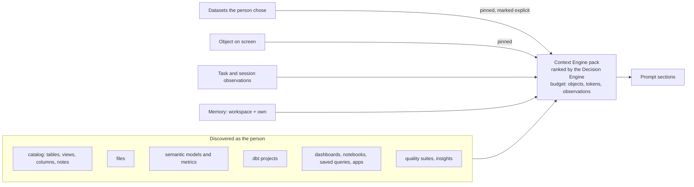

# Agent context

What the reasoning model is shown is decided per step, explicitly and within a budget — never the whole catalog or
every tool.

## Explicit and discovered

- **Explicit** — datasets chosen in the Agent Home (or passed as `datasets` over REST/MCP). The runtime checks each
  against what the person can see and refuses anything else; the Context Engine pins them and renders them under
  "Datasets the person chose (work with these first)".
- **Discovered** — tables the agent reaches through its tools that were not chosen. Each becomes a `dataset`
  artifact and an `agent.dataset.discovered` event; the mission shows them under "The agent found".

## What else the agent knows

Current user and permissions (through the principal), the workspace, the chosen datasets, the mission's earlier
requests, answers and artifacts, relevant catalog and semantic metadata (a matching metric is flagged so it is
queried, not re-derived), the selected tools, and memory. Discovery is cached briefly per workspace and person and
dropped when the workspace's data changes.

## Budget

`agent.budget`: `max_objects`, `max_tokens`, `max_tool_definitions`, `max_observations`, `max_result_rows`. Telemetry
records context considered, selected and its tokens per task.
