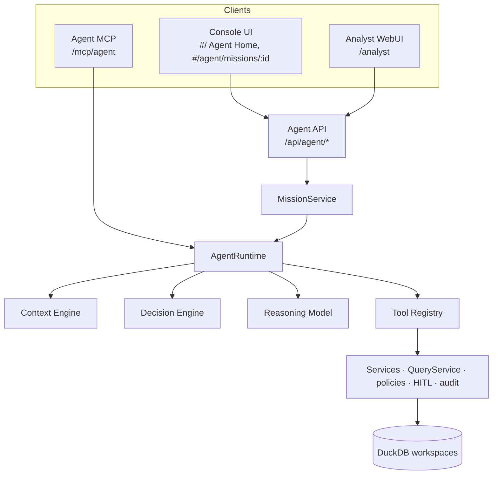
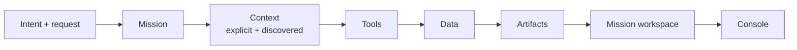

# Agent Home — target state

DuckView opens on the Agent: one question, the workspace and datasets it will work on, an intent, and the missions
in progress. A request becomes a **mission**; the mission becomes a **workspace** of results; results open in the
**console** as far as the person's access allows. The same Agent API serves the Console, the Analyst WebUI and the
Agent MCP server — there is one Agent Runtime.

## Product model

- **Agent Home (`#/`)** — ready state: "What are we working on?", the composer, Workspace and Dataset selectors, the
  intents (Analyse, Build, Investigate, Automate, Explore, Explain — hints to the same agent), active missions and
  recent work. First-time users get a "Start with your data" guide.
- **Mission (`#/agent/missions/:id`)** — working state (the request, the plan, live activity in words) turning into
  the mission workspace (summary, key findings, charts and tables, objects made, progress, context, activity) with a
  composer that continues the mission.
- **Console** — every other page, unchanged; the workspace overview that was `#/` is `#/home`.

## Reused versus new

| Concern | Reused | New |
|---|---|---|
| Agent behaviour | `AgentRuntime`, Context and Decision Engines, reasoning, tool registry, events, memory, approvals | Explicit datasets in the runtime (validated, pinned as context, marked "chosen"), discovered datasets as `dataset` artifacts, `finding` artifacts, chart hints on results |
| Missions | `agent_sessions` / `agent_tasks` rows | `mode`, `datasets`, `visibility` on sessions (migration 0046); `MissionService` (status, progress, activity, sharing, duplicate, archive) — no second state system |
| Permissions | workspace roles, scopes, policies (`restrictionFor`), `QueryService` | `capabilities()` — a read-only projection of those rules for the UI; per-artifact `open` decision |
| API | `/api/agent/tasks`, `/sessions`, SSE events | `/api/agent/home`, `/capabilities`, `/workspaces`, `/workspaces/:id/datasets`, `/missions…`, `/artifacts…` |
| UI | primitives, `ChartFrame`, dashboards' `ChartWidget`, `ResultPreview`, `ToolStep`, `ApprovalCard`, `Markdown`, workspace store | `features/agent/home/*`, `features/agent/mission/*`, `missions.ts` store, `surface.ts`; `Input`/`Textarea` gain a `bare` variant |
| Surfaces | Console shell | Analyst WebUI entry (`analyst.html`, `src/analyst/*`), served at `/analyst` |
| MCP | Agent MCP server | `start_mission`, `get_mission`, `resume_mission`, `create_analysis` |

Removed: the bottom agent dock (`AgentDock`, `AgentTaskView`, `AgentArtifacts`, its store). The agent has its own
place; ⌘I from any page opens the Agent Home with what was on screen offered as context.

## Design

The existing design system is kept (tokens, primitives, type scale, no gradients — enforced by `ui-lint`). The Agent
Home is the one page that uses the display size for its question; everything else follows the work-surface rules.
Dark first, light themes mirrored; the layout stacks below 640px.
