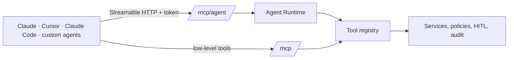

# Agent MCP

DuckView is an MCP server twice over: `/mcp` exposes the low-level tools (SQL, schemas, files, dashboards…), and
`/mcp/agent` exposes the agent — whole tasks and missions — through the same Agent Runtime as the UI.

## Tools

| Tool | Does |
|---|---|
| `ask_data_agent(request, mode?, session_id?)` | One task, waited for |
| `analyse_dataset(dataset, question?)` · `investigate_data(question)` · `explain_data(subject)` | Tasks with an intent |
| `build_dashboard(goal)` · `create_data_app(goal)` | Build tasks |
| `create_analysis(question, datasets?)` | A mission on chosen datasets, waited for |
| `start_mission(request, mode?, datasets?, title?)` | Starts a mission; returns at once |
| `get_mission(mission_id, wait_seconds?)` | Status, progress, context, findings, tasks |
| `resume_mission(mission_id, request?)` | Continues a mission |
| `get_agent_task(task_id, wait_seconds?)` · `list_agent_sessions()` | Follow-up and history |

Results are a stable contract (`taskId`, `sessionId`, `status`, `answer`, `plan`, `steps`, `artifacts`, `actions`,
`approval`, `telemetry`; missions add `progress`, `context`, `findings`), with MCP progress notifications while a task
runs.

## Access

A token with the `mcp` scope, usually bound to one workspace (Settings → Agents creates them and the client
configuration). The agent acts as the token's owner; changes that need approval pause with an `approveIn` link — a
person approves in DuckView, never the client. DuckView as an MCP client (remote agents over A2A, `ask_agent`) is
unchanged.
