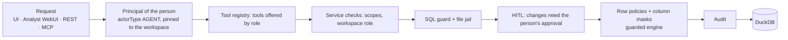

# Agent permissions

The agent is never a privileged user. Every call it makes goes through the same path as the person's own.

## What the server enforces

| Concern | Enforcement |
|---|---|
| Workspace access | `WorkspaceService.get` on every mission, dataset list, context discovery and tool call; tokens bound to a workspace stay there |
| Dataset access | Explicit datasets must be visible to the person (`resolveDatasets`); the dataset picker lists only what their access shows |
| Rows and columns | Access policies rewrite every statement (`policies.ts`); a prompt such as "ignore permissions" changes nothing |
| Tools | Viewers and read-only tokens are offered reading tools only; services refuse the rest anyway |
| Changes | HITL: the task pauses; only the person, signed in (not a token, not an agent), approves; then the call is repeated with `dry_run=false` |
| Export, publish, external side effects | Action classes in tool semantics; held by the services' approval checks |
| Audit | Tool calls, queries and `agent.task` rows carry actorType AGENT; approvals are logged as the person |

## Capabilities (for the UI)

`GET /api/agent/capabilities?workspace_id=` (also inside `/api/agent/home`) projects the rules above for the UI — it
grants nothing:

| Persona | From | Console |
|---|---|---|
| viewer | workspace VIEWER or read-only account | data, SQL read-only, dashboards and notebooks to view; no dbt, no connections, no approvals |
| analyst | EDITOR | SQL, notebooks, dashboards, quality, dbt |
| engineer | OWNER | as analyst, plus connections |
| admin | platform admin in the UI | everything, plus administration |

Each artifact of a mission carries `open: {allowed, reason}`. "Open in Console" is disabled with the reason when not
allowed (for example a dbt model for a viewer), and the console checks access again when it opens.

## Sharing missions

A mission is private until its owner shares it with the workspace. A member then sees it — but a member restricted by
an access policy in that workspace never sees the owner's values: answers, findings, result rows and the list's
activity line are hidden, the SQL and steps remain, and "Run as me" re-runs a result under the viewer's own policies
(`POST /api/agent/artifacts/:id/run`). Only the owner can continue, rename, share or archive it.
