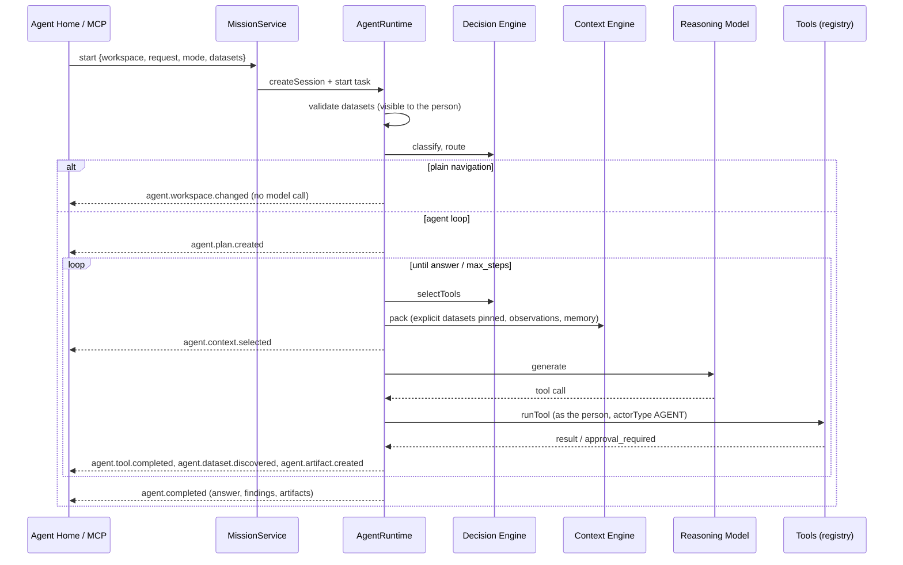

# Agent Runtime

`packages/server/src/agent/runtime/runtime.ts` (`AgentRuntime`) with `missions.ts` (`MissionService`). One runtime
serves the Console, the Analyst WebUI, REST and the Agent MCP server.

## Entities

| Entity | Stored as |
|---|---|
| AgentSession / **AgentMission** | `agent_sessions` (title, mode, datasets, visibility, page, archived) |
| AgentTask | `agent_tasks` (request, intent, status, plan, steps, artifacts, actions, approval, answer, telemetry, trace) |
| AgentPlan / AgentStep | `plan` and `steps` of a task (JSON) |
| AgentObservation | `agent_observations` |
| AgentMemory | `agent_memories` |
| AgentApproval | `approval` of a task |
| AgentArtifact | `artifacts` of a task: `table` (with `chart` hint), `finding`, `dataset`, `dashboard`, `notebook`, `app`, `quality_suite`, `dbt_model`, `metric`, `saved_query`, `file` |
| AgentEvent | the event bus (`agent/events.ts`) |
| AgentDecision / AgentContext | Decision Engine results and the Context Engine's pack (recorded in telemetry and the `agent.context.selected` event) |

## A mission's life

## Statuses and progress

`planning → running → (waiting_approval → running) → completed | failed | cancelled`. A mission's status is its latest
task's; progress is the share of its plan done (100 when completed); its activity is the active step, the approval,
or the answer's first line.

## Continuation

`POST /api/agent/missions/:id/messages` adds a task to the mission: earlier requests and answers, the session's
observations and the workspace's memory come with it, and the chosen datasets stay unless new ones are given.
`/resume` carries on after a failure or a cancellation.
