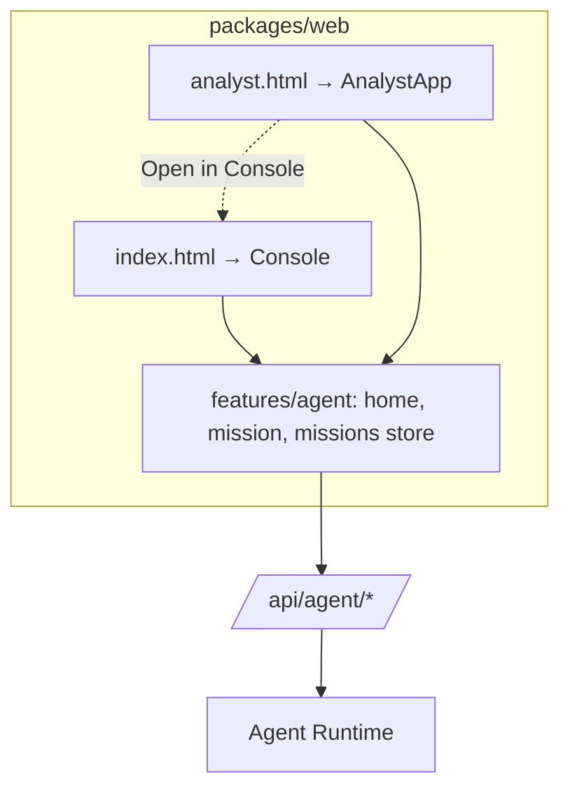

# Analyst WebUI

A second entry of the web package for people who work through the agent: `analyst.html` → `src/analyst/main.tsx`
(`AnalystApp`), served at `/analyst`. It contains sign-in, a thin header, the Agent Home and missions — the same
components the Console uses — and calls the same Agent API. It has no agent logic of its own.

## How it differs from the Console

- `setSurface('analyst')` (`features/agent/surface.ts`): console links (a dataset, SQL, a dashboard) leave for the
  Console (`/#/…`); a SQL result travels through session storage and opens as a new tab there. The Console checks
  access again when it opens.
- No rail, no section navigation: the header links to the Console for those who want it ("Console (view only)" for
  viewers, from the server's capabilities).
- Sign-in, workspace choice and theme are shared with the Console (same origin, same stores).

## Deploying it on its own

`pnpm --filter @duckview/web build` emits `dist/analyst.html` and its entry chunk beside the Console. It can be served
from any origin that proxies `/api` to DuckView; the Console link then points at the DuckView host.
